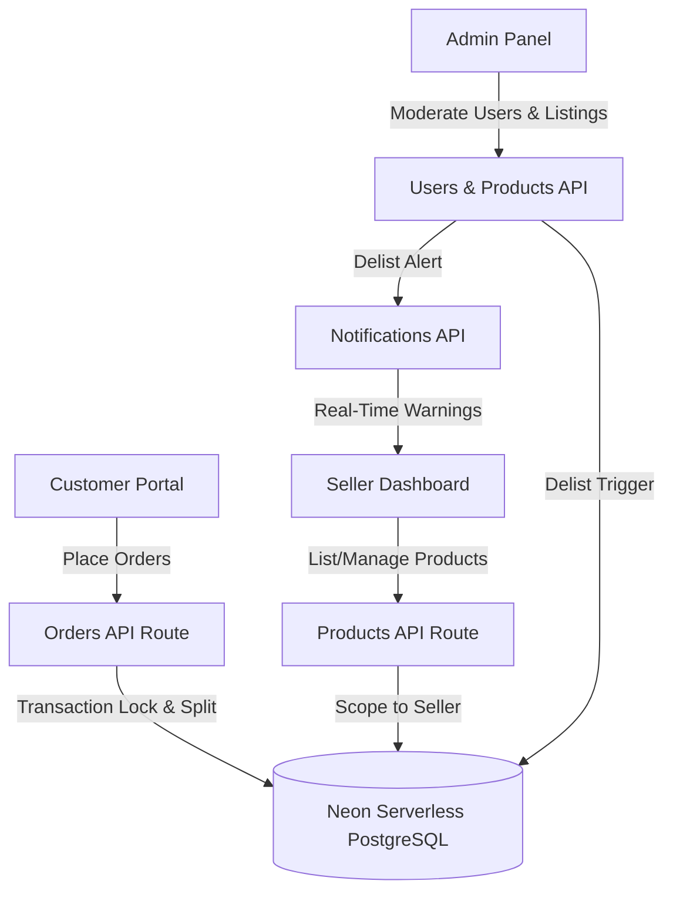
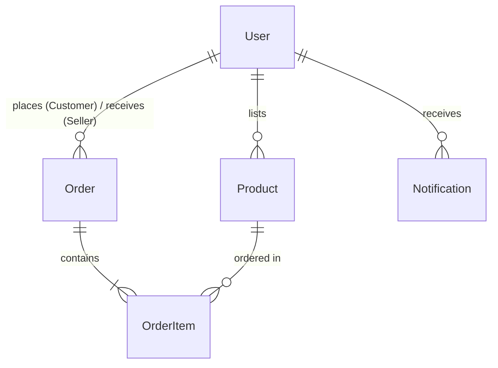

# AASAMEDCHEM - Pharma B2B/B2C Marketplace & Order Management System

AASAMEDCHEM is a professional, high-precision B2B/B2C inventory and multi-seller order management system built for the pharmaceutical industry. The system supports robust unit conversions, secure transactional inventory locks, automated multi-seller checkout splitting, and real-time delisting notifications. 

The application is styled with a premium, responsive **light pink** medical design theme.

---

## 🌟 Live Demo & Deployment
* **Live Deployment URL**: [https://aasamedchem.vercel.app](https://aasamedchem.vercel.app) *(or your deployed Vercel URL)*

---

## 🔑 Test Credentials for Evaluation
You can type these credentials or use the **Quick Fill** buttons on the login page:

* **Admin User**:
  * Username: `admin`
  * Password: `admin123`
* **Seller User**:
  * Username: `seller`
  * Password: `seller123`
* **Customer User**:
  * Username: `aman`
  * Password: `aman123`

---

## 🛠️ Tech Stack & System Architecture



### High-Level Architecture
1. **Frontend**: Built using Next.js client-side React components styled with premium **Vanilla CSS**. Features responsive, modern layouts with glassmorphic cards, alerts, and custom-themed scrollbars.
2. **Backend**: Next.js App Router Server APIs handle session token verification (using HMAC-SHA256 crypto cookies), product list management, order checkouts, and system notifications.
3. **Database**: Hosted on **Neon Serverless PostgreSQL**. **Prisma ORM** is used for schema structure, relations, and transactional database queries.

---

## 👥 Multi-Role Interactions

### 1. Admin Panel (`/admin`)
* **Platform Overview**: Displays statistics for Marketplace Users, active listings, total orders, and Gross Merchandise Value (GMV).
* **User Moderation**: Lists all registered customers and sellers with the option to delete accounts.
* **Product Moderation**: Inspects all active listings across the platform. Admins can delete any product not found genuine. Deleting a product automatically logs a system warning for the seller.
* **Order Monitoring**: Tracks every order placed on the platform.

### 2. Seller Panel (`/seller`)
* **Inventory Management**: Sellers can list, edit, or remove their own products, configure base price rates, and manage stock quantities.
* **Fulfillment Management**: Receives incoming orders placed for their products, allowing sellers to Approve, Reject, or Complete them.
* **System Alerts**: Displays a warning banner at the top of the dashboard containing real-time notifications if any of their products have been delisted by the Admin.

### 3. Customer Portal (`/customer`)
* **Marketplace Catalog**: Customers browse items listed by all sellers, showing tags like `"Sold by: Rohan Sharma"`.
* **Configurator**: Selects compatible ordering units (e.g. grams vs. kilograms) with real-time conversion previews, price calculations, and stock checks.
* **Multi-Seller Checkout**: When checking out a cart containing items from multiple sellers, the backend transaction split-groups the items by `sellerId`, creating distinct orders per seller.
* **Purchase History**: Tracks the approval and completion status of their orders.

---

## 📊 Database Schema & Key Tables



1. **`User` (Accounts)**: Stores credentials (hashed using SHA-256), names, and roles (`ADMIN`, `SELLER`, `CUSTOMER`).
2. **`Product` (Inventory Items)**: Stores SKU codes, descriptions, prices, categories, stocks in base units, and links to the owner (`sellerId`).
3. **`Order` (Quotations)**: Tracks orders placed by a Customer (`userId`) to a specific Seller (`sellerId`) with statuses (`PENDING`, `APPROVED`, `REJECTED`, `COMPLETED`).
4. **`OrderItem` (Order Lines)**: Records ordered quantities/units, conversion metrics, base units, rates, and final item price at checkout time.
5. **`Notification` (System Alerts)**: Stores warnings for sellers when items are delisted by the Admin.

---

## ⚖️ Unit Storage & Conversion Strategy
To support high-precision medical measurements (e.g. milligrams of powder, milliliters of liquid, or precise batch counts) and avoid floating-point rounding errors, the database uses PostgreSQL's native `NUMERIC` data type.

1. **Strict Base Unit Storage**: Inventory levels (`stockQuantity`) and prices (`pricePerBaseUnit`) are stored **strictly in the product's configured base unit**. E.g., if the base unit is `g`, stock is stored in grams, and price is per gram.
2. **Dimensions & Conversions**:
   * **Mass**: Grams (`g`), Kilograms (`kg`) [1 kg = 1000 g]
   * **Volume**: Milliliters (`mL`), Liters (`L`) [1 L = 1000 mL]
   * **Count**: Items (`items`) [1 item = 1 item]
3. **Transactions**: The API routes verify stock sufficiency in the product's base unit. If stock is available, it decrements the stock inside a `db.$transaction` database lock. If an order is rejected, the stock is automatically restored.

---

## 🚀 Setup Instructions (Local Execution)

### 1. Install Dependencies
```bash
npm install
```

### 2. Configure Environment Variables
Create a file named `.env` in the root directory:
```env
DATABASE_URL="your-postgresql-neon-database-url"
SESSION_SECRET="your-session-secret-key"
```

### 3. Setup Database Schema & Seed Data
```bash
# Push schema structure to Neon PostgreSQL
npx prisma db push --force-reset

# Seed users and sample products
node prisma/seed.js
```

### 4. Run Locally
```bash
# Run local development server
npm run dev
```
Open [http://localhost:3000](http://localhost:3000) in your browser.

### 5. Run Unit Tests
To verify unit conversions and calculations:
```bash
node src/lib/__tests__/units.test.js
```

---

## ☁️ Deployment to Vercel

The application is fully configured and ready for serverless deployments on Vercel:

1. **Push your code to GitHub**:
   ```bash
   git init
   git add .
   git commit -m "feat: initial implementation of AASAMEDCHEM"
   ```
2. **Deploy on Vercel**:
   * Log into [vercel.com](https://vercel.com) and import your repository.
   * Add the following **Environment Variables** in the Vercel project settings:
     * `DATABASE_URL`: `your-postgresql-neon-database-url`
     * `SESSION_SECRET`: `your-session-secret-key`
   * Click **Deploy**. Vercel will compile the Next.js production build and supply a live URL!

