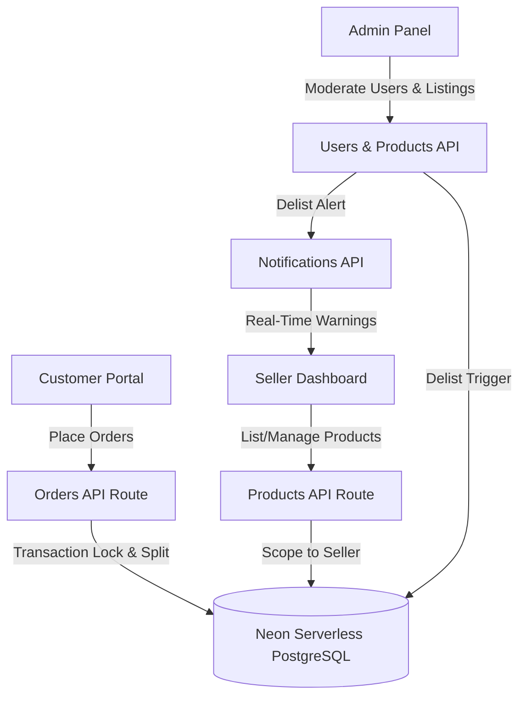
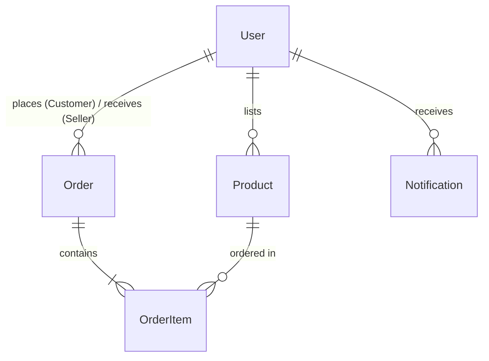

# AASAMEDCHEM - Pharma B2B/B2C Marketplace & Order Management System

AASAMEDCHEM is a professional, high-precision B2B/B2C inventory and multi-seller order management system built for the pharmaceutical industry. The system supports robust unit conversions, secure transactional inventory locks, automated multi-seller checkout splitting, and real-time delisting notifications. 

The application is styled with a premium, responsive **light pink** medical design theme.

---

## 🌟 Live Demo & Deployment
* **Live Deployment URL**: [https://aasamedchem-phi.vercel.app/login](https://aasamedchem-phi.vercel.app/login)

---

## 🔑 Test Credentials for Evaluation
You can type these credentials or use the **Quick Fill** buttons on the login page:

* **Admin User**:
  * Username: `admin`
  * Password: `admin123`
* **Seller User**:
  * Username: `seller`
  * Password: `seller123`
* **Customer User**:
  * Username: `aman`
  * Password: `aman123`

---

## 🛠️ Tech Stack & System Architecture



### High-Level Architecture
1. **Frontend**: Built using Next.js client-side React components styled with premium **Vanilla CSS**. Features responsive, modern layouts with glassmorphic cards, alerts, and custom-themed scrollbars.
2. **Backend**: Next.js App Router Server APIs handle session token verification (using HMAC-SHA256 crypto cookies), product list management, order checkouts, and system notifications.
3. **Database**: Hosted on **Neon Serverless PostgreSQL**. **Prisma ORM** is used for schema structure, relations, and transactional database queries.

---

## 👥 Multi-Role Interactions & Advanced Functionalities

AASAMEDCHEM implements a highly secure, role-restricted operational workflow dividing the platform into three specific personas. Each role is guarded by custom HMAC-SHA256 cryptographic cookie-based session verification.

---

### 1. Admin Control Console (`/admin`)
The **Admin Panel** provides global marketplace oversight, analytics monitoring, user moderation, and product list policing.

* **Exposed Frontend UI**:
  * **Admin Dashboard Overview**: Live platform-wide KPIs (Active Users count, Active Products count, Total Orders count, and live aggregated Gross Merchandise Value (GMV) calculated on the server).
  * **User Control Center**: Interactive tabular list of all registered Sellers and Customers with detailed metadata.
  * **Global Catalog Inspector**: Comprehensive listing of all platform products with complete seller attribution.
  * **System-Wide Order Logs**: Unified list of all orders placed across the system.
* **Core Capabilities & Functions**:
  * **Global User Moderation**: Authority to terminate/delete customer or seller accounts. Deleting a user safely cascades through relational constraints in the database.
  * **Direct Product Delisting**: Ability to delete any listed product (e.g. in case of counterfeit items or price anomalies).
  * **Automated Alert Generation**: Delisting a product dynamically initiates an automated pipeline that injects an urgent alert notification in the `Notification` table, targeted specifically at the product's Seller.
* **Exposed Backend API Endpoints**:
  * `GET /api/users` — Fetches the list of all registered platform users.
  * `DELETE /api/users/[id]` — Restrictedly deletes a platform user account.
  * `GET /api/products` — Fetches all platform listings.
  * `DELETE /api/products/[id]` — Delists a product and automatically generates a delisting notification for the corresponding seller.
  * `GET /api/orders` — Retreives all platform orders for GMV aggregation.

---

### 2. Seller Inventory & Order Dashboard (`/seller`)
The **Seller Dashboard** acts as an ERP panel for individual merchants, enabling catalog governance, transactional order fulfillment, and notification awareness.

* **Exposed Frontend UI**:
  * **Delisting Warning Banner**: A real-time notification alert bar at the top of the dashboard containing alerts of products delisted by Admin.
  * **Active Inventory List**: Table showing the seller's own products, current base stock, and configured base pricing.
  * **Product Creation & Modification Modal**: Pop-ups to list new items or edit existing ones.
  * **Order Fulfillment Center**: Segmented order tracker displaying orders pending approval, active, or complete.
* **Core Capabilities & Functions**:
  * **Siloed Catalog Management (CRUD)**: Sellers can create, read, update, and delete their own products. Products are hard-linked to the seller's authenticated session, preventing cross-tenant access.
  * **Dynamic Unit Setup**: Sellers register products using specific Base Units (e.g., `g`, `mL`, `items`) and assign price rates relative to that base unit.
  * **Stateful Order Fulfillment & Stock Locking**:
    * **Approve Order**: Transactionally checks if current stock supports the order. If yes, it decrements the inventory level and locks the stock, changing status to `APPROVED`.
    * **Reject Order**: Cancels the order, restoring any allocated stock back to inventory if the order had been approved, and updates status to `REJECTED`.
    * **Complete Order**: Finalizes the lifecycle, setting status to `COMPLETED`.
  * **Real-time Alert Acknowledgement**: Allows sellers to dismiss notifications once read.
* **Exposed Backend API Endpoints**:
  * `GET /api/products?sellerId=...` — Fetches the authenticated seller's inventory.
  * `POST /api/products` — Adds a new product linked to the logged-in seller.
  * `PUT /api/products/[id]` — Modifies an existing product (enforces owner validation).
  * `DELETE /api/products/[id]` — Removes a product owned by the seller.
  * `GET /api/orders` — Retreives orders received by the seller.
  * `PUT /api/orders/[id]` — Processes order status transitions (Approved, Rejected, Completed) with concurrent stock adjustments.
  * `GET /api/notifications` — Checks active delisting alerts for the logged-in seller.
  * `PUT /api/notifications` — Dismisses active delisting notifications.

---

### 3. Customer Catalog & Order Portal (`/customer`)
The **Customer Portal** allows users to browse active products across all sellers, compute exact volume/mass conversions on the fly, checkout with automatic cart-splitting, and trace purchase status.

* **Exposed Frontend UI**:
  * **Global Catalog Explorer**: Browse and search active items with explicit "Sold by [Seller Name]" badges.
  * **Unit Conversion & Order Configurator**: Slide-out panel that performs real-time unit translation calculations.
  * **Unified Shopping Cart**: Dynamic list tracking items selected across different sellers.
  * **My Orders Ledger**: Complete timeline view of historical orders with color-coded status badges (`PENDING`, `APPROVED`, `REJECTED`, `COMPLETED`).
* **Core Capabilities & Functions**:
  * **High-Precision Multi-Unit Order Configurator**: Calculates purchasing volumes. For example, if a seller stores a product in grams (`g`), the customer can configure their order in kilograms (`kg`). The system validates the stock limits in base units and displays real-time pricing conversions (`1 kg = 1000 g`).
  * **Transactional Multi-Seller Cart Splitting**: Customers can add items from multiple distinct sellers to one cart. On checkout, the backend parses the checkout body, groups items by `sellerId`, and executes atomic writes to construct unique sub-orders for each seller, guaranteeing that sellers only see their own items.
* **Exposed Backend API Endpoints**:
  * `GET /api/products` — Reads the global product catalog.
  * `GET /api/orders` — Pulls customer's historical orders.
  * `POST /api/orders` — Performs atomic cart-split checkout logic.

---

## ⚡ Advanced Engineering Systems (Behind the Scenes)

### 🔄 Multi-Seller Order Split Checkout Engine
When checking out a mixed cart, standard e-commerce databases risk data fragmentation or incorrect order views. AASAMEDCHEM resolves this by splitting order objects at the API layer:
1. The frontend submits a single cart array containing items with different `sellerId`s.
2. The `/api/orders` POST handler groups order items by `sellerId`.
3. It performs a database transaction (`db.$transaction`) where:
   - A parent `Order` is created for *each* seller containing their specific subset of items.
   - Separate `OrderItem` lines are generated mapping to each product.
   - The buyer receives a summary of all split orders created.

### ⚖️ Real-Time Metric Unit Translation
Medical B2B orders require flexible scale selection. The conversion logic runs on both sides:
- **Frontend Previews**: When a customer changes the unit from the product's base unit (e.g. `mL` to `L`), the configurator uses mathematical scaling to preview quantities and calculate price tags:
  $$\text{Converted Qty} = \text{Input Qty} \times \text{Multiplier}$$
  $$\text{Converted Price} = \frac{\text{Base Price}}{\text{Multiplier}}$$
- **Backend Validation**: During cart checking and order insertion, the API sanitizes the unit input, normalizes the ordered amount back into the product's **base unit**, verifies stock availability, and saves the conversion ratios in `OrderItem` to maintain price auditing.

### 🔒 Stock-Lock & Auto-Reversion Lifecycle
To prevent overselling and inventory race-conditions:
* Orders default to `PENDING` (no stock is deducted yet).
* Upon seller approval (`APPROVED`), the system performs an atomic check. If stock is available, it decrements the `Product.stockQuantity`.
* If a seller subsequently rejects the order, or if the order is cancelled, a reversal script increments the inventory level by the locked quantity:
  ```javascript
  if (oldStatus === 'APPROVED' && newStatus === 'REJECTED') {
    // Automatically revert the product stock in database
    await tx.product.update({
      where: { id: item.productId },
      data: { stockQuantity: { increment: item.baseQuantity } }
    });
  }
  ```

---


## 📊 Database Schema & Key Tables



1. **`User` (Accounts)**: Stores credentials (hashed using SHA-256), names, and roles (`ADMIN`, `SELLER`, `CUSTOMER`).
2. **`Product` (Inventory Items)**: Stores SKU codes, descriptions, prices, categories, stocks in base units, and links to the owner (`sellerId`).
3. **`Order` (Quotations)**: Tracks orders placed by a Customer (`userId`) to a specific Seller (`sellerId`) with statuses (`PENDING`, `APPROVED`, `REJECTED`, `COMPLETED`).
4. **`OrderItem` (Order Lines)**: Records ordered quantities/units, conversion metrics, base units, rates, and final item price at checkout time.
5. **`Notification` (System Alerts)**: Stores warnings for sellers when items are delisted by the Admin.

---

## ⚖️ Unit Storage & Conversion Strategy
To support high-precision medical measurements (e.g. milligrams of powder, milliliters of liquid, or precise batch counts) and avoid floating-point rounding errors, the database uses PostgreSQL's native `NUMERIC` data type.

1. **Strict Base Unit Storage**: Inventory levels (`stockQuantity`) and prices (`pricePerBaseUnit`) are stored **strictly in the product's configured base unit**. E.g., if the base unit is `g`, stock is stored in grams, and price is per gram.
2. **Dimensions & Conversions**:
   * **Mass**: Grams (`g`), Kilograms (`kg`) [1 kg = 1000 g]
   * **Volume**: Milliliters (`mL`), Liters (`L`) [1 L = 1000 mL]
   * **Count**: Items (`items`) [1 item = 1 item]
3. **Transactions**: The API routes verify stock sufficiency in the product's base unit. If stock is available, it decrements the stock inside a `db.$transaction` database lock. If an order is rejected, the stock is automatically restored.

---

## 🧠 Advanced Scaling & Concurrency Architecture
For a deep-dive analysis of caching strategies, Redis distributed locks, deadlock prevention, and database transaction isolations, please see the [SCALING_ROADMAP.md](file:///c:/Users/AMAN%20KUMAR%20SINGH/Desktop/ASSAMEDCHEM/SCALING_ROADMAP.md) document in the root directory.

---

## 🚀 Setup Instructions (Local Execution)

### 1. Install Dependencies
```bash
npm install
```

### 2. Configure Environment Variables
Create a file named `.env` in the root directory:
```env
DATABASE_URL="your-postgresql-neon-database-url"
SESSION_SECRET="your-session-secret-key"
```

### 3. Setup Database Schema & Seed Data
```bash
# Push schema structure to Neon PostgreSQL
npx prisma db push --force-reset

# Seed users and sample products
node prisma/seed.js
```

### 4. Run Locally
```bash
# Run local development server
npm run dev
```
Open [http://localhost:3000](http://localhost:3000) in your browser.

### 5. Run Unit Tests
To verify unit conversions and calculations:
```bash
node src/lib/__tests__/units.test.js
```

---

## ☁️ Deployment to Vercel

The application is fully configured and ready for serverless deployments on Vercel:

1. **Push your code to GitHub**:
   ```bash
   git init
   git add .
   git commit -m "feat: initial implementation of AASAMEDCHEM"
   ```
2. **Deploy on Vercel**:
   * Log into [vercel.com](https://vercel.com) and import your repository.
   * Add the following **Environment Variables** in the Vercel project settings:
     * `DATABASE_URL`: `your-postgresql-neon-database-url`
     * `SESSION_SECRET`: `your-session-secret-key`
   * Click **Deploy**. Vercel will compile the Next.js production build and supply a live URL!

