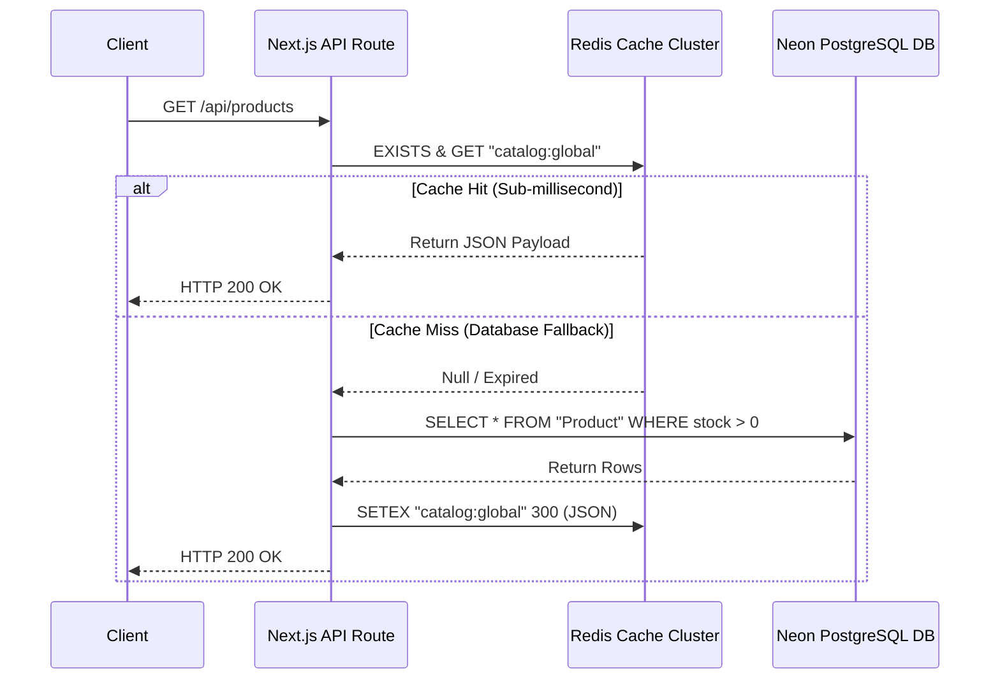
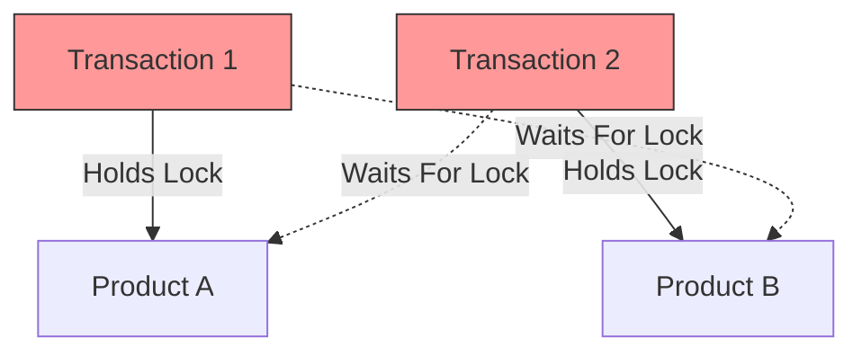

# 🧠 AASAMEDCHEM — Scalability, Concurrency & Transactional Integrity Roadmap

This document outlines the advanced engineering architecture designed to scale the AASAMEDCHEM B2B/B2C marketplace to support enterprise-level traffic, prevent resource deadlocks under concurrent order surges, and enforce strict database ACID properties.

> [!NOTE]
> **TL;DR — Core Scaling & Integrity Mechanisms**
> * **Redis Caching**: Uses Cache-Aside logic for the product catalog to bypass database calls on read operations and provides sub-millisecond session validation.
> * **Concurrency Control**: Prevents stock overselling using Redis-based distributed locks (Redlock) and eliminates database deadlocks by sorting product IDs before executing sequential database queries.
> * **ACID Integrity**: Runs multi-seller cart splitting within unified database transactions executing at `Repeatable Read` / `Serializable` isolation levels.

---

## ⚡ 1. Scalable Read/Write Caching with Redis

To support a 10x or greater increase in traffic, we decouple direct read pressure from the primary PostgreSQL database by implementing a distributed cache layer using Redis.



### Key Implementation Patterns

#### A. Cache-Aside (Read-Through) for Catalog Browsing
* **Target Endpoint**: `GET /api/products`
* **Mechanism**: The API checks Redis under the key `catalog:global` or `catalog:seller:[id]` (for specific vendors). If found, it bypasses the database completely. If not found, it queries PostgreSQL, writes the catalog list to Redis with a 5-minute Time-To-Live (TTL), and serves the client.

#### B. Active Cache Invalidation on Mutation
To prevent customers from buying out-of-stock items due to stale cache files, database writes must proactively clear corresponding Redis keys:
```javascript
// Invoked inside Product creation, update, or deletion APIs
async function invalidateProductCache(sellerId) {
  const pipeline = redis.pipeline();
  pipeline.del("catalog:global");
  if (sellerId) {
    pipeline.del(`catalog:seller:${sellerId}`);
  }
  await pipeline.exec();
}
```

#### C. Redis-Backed Session Store
Rather than decoding and verifying cryptographic session tokens on every single incoming HTTP request (which consumes CPU cycles), session UUIDs are stored in Redis (`session:[uuid]` -> `{ userId, role, username }`).
* **Performance**: Reduces auth check duration to $< 1\text{ms}$.
* **Capability**: Allows immediate, global revocation of user sessions (e.g., if an Admin suspends a user).

---

## 🔒 2. Concurrency, Race Condition & Deadlock Avoidance

Under heavy ordering loads (e.g., high-volume medical batch checkouts), multiple customers may try to purchase the same inventory items simultaneously.

### A. Distributed Locks with Redis (Redlock)
To prevent double-spend or overselling inventory bugs *before* queries touch PostgreSQL, we utilize atomic Redis locks.

```javascript
import Redis from 'ioredis';
const redis = new Redis(process.env.REDIS_URL);

async function acquireInventoryLock(productId, acquireTimeoutMs = 5000) {
  const lockKey = `lock:product:${productId}`;
  const uniqueToken = Math.random().toString(36).substring(2);
  const end = Date.now() + acquireTimeoutMs;

  while (Date.now() < end) {
    // NX: only set if not exists | PX: automatically expire in 10s to prevent stale locks
    const acquired = await redis.set(lockKey, uniqueToken, 'NX', 'PX', 10000);
    if (acquired === 'OK') {
      return uniqueToken; // Lock successfully held
    }
    // Sleep briefly before retrying
    await new Promise(resolve => setTimeout(resolve, 50));
  }
  throw new Error("Unable to acquire lock: Product inventory busy.");
}

async function releaseInventoryLock(productId, token) {
  const lockKey = `lock:product:${productId}`;
  // Use Lua script to safely release lock only if the token matches (prevents releasing other transactions' locks)
  const luaScript = `
    if redis.call("get", KEYS[1]) == ARGV[1] then
      return redis.call("del", KEYS[1])
    else
      return 0
    end
  `;
  await redis.eval(luaScript, 1, lockKey, token);
}
```

### B. Prevention of Cyclic Deadlocks (Lock Ordering)
A common deadlock occurs when transaction `T1` locks Product A and waits for Product B, while transaction `T2` locks Product B and waits for Product A.



**Architectural Standard**: To avoid this, we always sort target product IDs alphabetically or numerically before acquiring any database row locks. This enforces a strict, predictable sequential acquisition pattern, making cyclic waits mathematically impossible.
```javascript
// ALWAYS sort the IDs of items being checked out
const sortedProductIds = [...cart.map(item => item.productId)].sort();

// Execute sequence-order locking queries inside transaction
for (const productId of sortedProductIds) {
  await tx.$executeRaw`
    SELECT * FROM "Product" 
    WHERE id = ${productId} 
    FOR UPDATE;
  `;
}
```

---

## 🏛️ 3. Strict Application of ACID Properties

We enforce database integrity by structuring database writes to conform to full ACID principles:

### Atomicity & Consistency (Atomic Transactions)
All multi-seller cart-split operations, inventory deductions, and quotation generations are executed inside a single database transaction block. If a single item fails validation, the entire database state rolls back:
```javascript
await prisma.$transaction(async (tx) => {
  // 1. Lock rows in order & fetch fresh stock levels
  const lockedProducts = [];
  for (const id of sortedProductIds) {
    const [prod] = await tx.$queryRaw`SELECT * FROM "Product" WHERE id = ${id} FOR UPDATE`;
    lockedProducts.push(prod);
  }

  // 2. Validate stock levels
  for (const item of cartItems) {
    const dbProduct = lockedProducts.find(p => p.id === item.productId);
    if (dbProduct.stockQuantity < item.neededQuantityInBaseUnit) {
      throw new Error(`Insufficient stock for product ${dbProduct.name}`);
    }
  }

  // 3. Decrement Inventory
  for (const item of cartItems) {
    await tx.product.update({
      where: { id: item.productId },
      data: { stockQuantity: { decrement: item.neededQuantityInBaseUnit } }
    });
  }

  // 4. Write parent orders and child items
  await tx.order.createMany({ data: splitOrderHeaders });
  await tx.orderItem.createMany({ data: splitOrderItems });
}, {
  // Enforce rigid isolation levels if required by the cloud DB provider
  isolationLevel: 'Serializable' 
});
```

### Isolation Levels
We handle concurrent read/write isolation levels carefully:
* **`Read Committed`** (Default): Prevents dirty reads. Sellers won't see partially processed orders.
* **`Repeatable Read`**: Ensures that if a seller reviews inventory levels twice within the same transaction, the values remain consistent.
* **`Serializable`**: The highest isolation level. Used during cart checkout to simulate sequential execution, eliminating any risk of write-skew or double-spending.

### Durability
Durability is guaranteed by Neon's PostgreSQL storage engine:
* Every commit is written to Neon's distributed storage nodes and recorded in **Write-Ahead Logging (WAL)** before transaction success is acknowledged.
* In production, synchronous replication ensures commit records are saved across multiple physical nodes to safeguard against server crashes.
